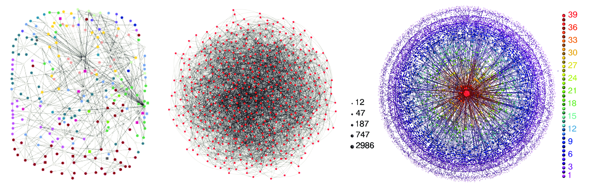
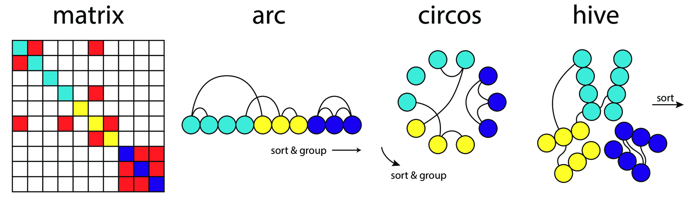

# slides are available online

slides: [ericmjl.github.io/big-data-boston-2016](http://ericmjl.github.io/big-data-boston-2016)
source: [github.com/ericmjl/big-data-boston-2016](https://github.com/ericmjl/big-data-boston-2016)

# about myself

- doctoral candidate, MIT biological engineering
- self-taught pythonista
- using networks to problems in infectious disease ecology, evolution & biochemistry

# outline

1. what are networks?
1. example 1: recommendation systems
1. example 2: panama papers
1. example 3: influenza ecology & evolution
1. example 4: neural networks on networks

# what are networks

{#networks .class width=350}

# example 1: recommendation systems

{#recommender .class width=200}

# example 1: recommendation systems

![if `A` and `B` share overlapping interests, then maybe some of `B`'s interests can be recommended to `A`.[^collab]](./figures/collaborative-filtering.png){#recommender .class width=350}

[^collab]: [Collaborative filtering](https://en.wikipedia.org/wiki/Collaborative_filtering)

# example 2: panama papers

![graph databases were used to show how the rich hide their money.[^money]](./figures/panama.png){#panama .class width=350}

[^money]: [ICIJ and Neo4j unravel the panama papers.](https://neo4j.com/blog/icij-neo4j-unravel-panama-papers/)

# example 3: influenza ecology and evolution

![for influenza, gene shuffling probably helps in host switching.[^pnas]](./figures/influenza.png){#flu .class width=380}

[^pnas]: [Reticulate evolution is favoured in influenza niche switching.](http://www.pnas.org/content/113/19/5335.abstract)

# example 4: neural networks on networks

![graph convolutions let us do machine learning on graph-structured data.[^graphconv]](./figures/convolutions.png){#convolutions .class width=350}

[^graphconv]: [Convolutional Networks on Graphs for Learning Molecular Fingerprints](https://arxiv.org/abs/1509.09292)

# visualize networks rationally

{#hairballs .class width=400}

# visualize networks rationally

{#rational-viz .class width=400}

# conclusions

- think relationally
- networks can be used creatively to solve all sorts of problems

# keep in touch

- personal website: [ericmjl.com](http://www.ericmjl.com/)
- linkedin: [linkedin.com/in/ericmjl](http://www.linkedin.com/in/ericmjl/)
- datacamp: network analysis course coming within the next few months!
- available for training your staff on data analysis and network science
