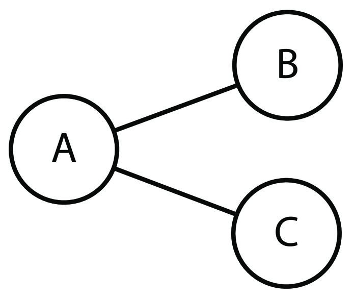

# slides are available online

github: http://github.com/ericmjl/big-data-boston-2016/

# about myself

- doctoral candidate, MIT biological engineering
- self-taught pythonista
- using networks to problems in infectious disease ecology, evolution & biochemistry

# outline

1. what are networks?
1. example 1: recommendation systems - cliques
1. example 2: panama papers - path tracing
1. example 3: influenza ecology & evolution - network statistics
1. example 4: neural networks on networks - graph deep learning

# what are networks

networks, a.k.a. **graphs**, are composed of **nodes** (circles) and **edges** (lines)

{#networks .class width=400}

# example 1: recommendation systems

if `A` is connected to `B` and `C`, but `B` and `C` are not connected, then maybe they should be!

{#recommender .class width=300}

# example 1: recommendation systems

{#recommender .class width=400}

# example 2: influenza ecology and evolution

# example 3: neural networks on networks

# conclusions

- think relationally
- networks can be used creatively to solve all sorts of problems

# keep in touch

- personal website: [ericmjl.com](http://www.ericmjl.com/)
- available for data and network science training
-
